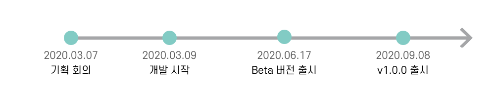

#  I am

<pre>
안녕하세요. 저는 객체지향 설계와 리팩토링을 좋아하는 자바 백엔드 개발자 또링입니다. 
어떻게 하면 최선의 코드가 나올지 항상 의구심을 품고 고민하는 것을 좋아합니다.
처음엔 단순히 서비스를 출시하는 것에서 느껴지는 성취감으로 개발을 시작했지만,
여러 고민을 하며 느껴지는 성장으로 인한 성취감이 좋아 본격적으로 개발을 하게 되었습니다.

현재는 우아한테크코스2기 자바 웹 백엔드 개발자 교육과정을 통해 객체지향과 TDD, 클린 코드에 대해 학습하고 있습니다.
테스트 코드 한 줄 없던 레벨1 초반의 사이드 프로젝트 덕분에 테스트의 중요성을 깨달았습니다. 
그 이후의 미션과 프로젝트에서는 TDD와 ATDD방식의 개발을 통해 안정성있는 코드를 작성하고 있습니다.
또한, 두 개의 서비스를 출시하여 사용자의 피드백을 바탕으로 개선해나가는 경험도 하고 있습니다.
</pre>

 TMI 

<h3> 🧩 취미는 퍼즐입니다. </h3>
<pre>
- 엄청난 몰입감 덕분에 벌써 10년째 하고 있네요.
- 아직 못 맞춘 퍼즐도 있습니다.(고등학생 때 친구들에게 선물 받은 고흐의 별이 빛나는 밤 - 2000피스✨)
</pre>

<h3> 🗂 정리 및 기록 그리고 계획 세우는 것을 좋아합니다. (ESFJ) </h3>
<pre>
- 초~고등학생 때까지는 노트와 다이어리에 기록을
- 대학생 초반까지는 에버노트에 기록을
- 지금은 노션과 아이패드 굿노트 앱에 템플릿을 직접 만들어 기록합니다.
</pre>

 Goals 

<h3>🗓 2030</h3>
<pre>
🌎 <b>파워(기술)블로거</b>
    - 양보단 질로 승부하기
    - 코멘트로 활발한 토론하기
💪🏻 <b>하나를 깊게 이해하기</b>
    - 하나를 깊게 마스터하여 새로운 기술이나 처음 써보는 기술도 금방 익힐 수 있는 능력 갖추기
</pre>
<h3>🗓 2040</h3>
<pre>
👭 <b>친구 하고 싶은 사람</b>
    - 같은 40대에게도, 한참 어린 20대에게도, 조금 높은 50대에게도 친구 하고 싶은 사람
    - 모든 이의 의견을 잘 들어줄 수 있는 사람
    - 논리와 근거 없이 내 주장을 고집하지 않는 사람
💬 <b>회고 21년차</b> 
    - 내가 나에 대해 늘 고민하고 멈춰있지 않기
    - 발전하기 위해 노력하기
</pre>

    
# ⚒ Skills

- **Spring Boot를 사용하여 서버를 구축할 수 있습니다.**
   - Spring과 Spring Boot의 차이에 대해 인지하고 사용하고 있습니다.(관련 [영상](https://www.youtube.com/watch?v=OdpPvdB7qZY) 및 [포스팅](https://ssoco.tistory.com/66?category=840029))
   - Spring Data JPA와 같은 ORM 기술을 학습하여 사용하고 있습니다.
   - Spring Rest Docs와 같은 문서화 도구를 학습하여 API 문서화를 하고 있습니다.
- **인프라 구축에 대해 이해도를 높이고 있습니다.**
   - CI/CD 환경을 구축하여 빌드와 배포를 자동화 할 수 있습니다.
- **테스트의 중요성을 깨닫고, 어떤 테스트 코드가 좋은 코드인지 고민합니다.**
   - ATDD를 통해 전반적인 요구사항에 검증하며 API 개발을 할 수 있습니다.

# 🗂 Currently working on

## 직고래

 
 

### 소개
**당신이 속한 조직 어디든 당신이 원하는 것을 사고파세요. 조직 중고 거래, 직고래**
- 직고래는 따뜻한 교류가 있는 조직 벼룩시장을 꿈꾸고 있어요.

### 연혁

### 담당 업무

- 도메인 간의 연관 관계 설계
- ATDD 방식의 API 개발
- Jenkins를 이용한 CI/CD 구축
- Expo를 이용한 Android App 배포 

### 기술 스택
Spring Boot, Spring Data JPA, Spring Security, Oauth2, ReactNative, MariaDB

AWS EC2, Docker, Jenkins, Flyway

## SUPP
  

### 소개
**식전 수프처럼 페어와의 협업 맛을 돋우는 애피타이저, SUPP**
- SUPP의 개발자 유형 검사를 통해 자신의 개발 성향을 알 수 있어요.
- 페어 프로그래밍이나 팀 프로젝트 시, 자주 언급되는 몇 가지 규칙에 대하여 손쉽게 작성하고, 편하게 볼 수 있어요.

### 연혁

### 담당 업무
**기간 : 기획 ~ 베타 버전 출시**
- 핵심 엔티티 설계 및 구현

**기간 : 베타 버전 ~ v1.0.0**
- 전체적인 예외 처리 코드 작성

### 기술 스택
Spring Boot, Spring Data JPA, Spring Security, Oauth2, Mustache, MariaDB

AWS EC2, RDB, CloudFront
 

---

